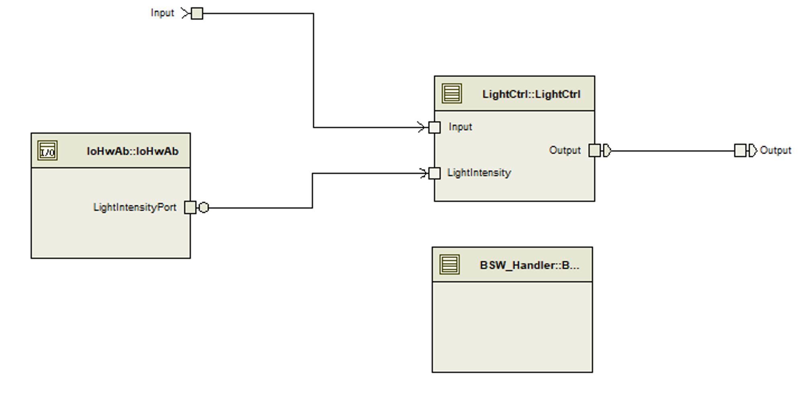

## About the ECU

This example shows an ECU called Body Front Controller. This controller implements the control of the light system in the car.
As an input the ECU gets the light switch (OFF; ON; Auto) and the environment light intensity.
The output is the head light of the car and should turn on if

- the light switch is set to the value ‘ON’ or
- the light switch is set to the value ‘Auto’ and the environment light intensity falls below a limit.

    
    

The ECU consists of three SWCs to implement the light control (see picture below):

- SWC ‘LightCtrl’ calculates every 10 ms the value for the head light (sender receiver port ‘Output’) based on the light switch (sender receiver port ‘Input’) and the light intensity (client port ‘LightIntensity’).
- SWC ‘IoHwAb’ reads the digital input/output from the ‘ADC’ basic software module which is automatically linked to a system variable in CANoe in the virtual environment.
- SWC ‘BSW_Handler’ keeps the ECU alive by requesting an AUTOSAR ComM User with the parameter COMM_FULL_COMMUNICATION.

    

The ports ‘Input’ and ‘Output’ are mapped to a CAN system signal in the basic software via Data Mapping and can be accessed via a corresponding CAN signal on the bus.  
The environment light intensity will be read by a ADC channel mapped to a real hardware pin on the real ECU.  
For the virtual environment the ADC channel will be automatically linked to a system variable and can be stimulated in CANoe.