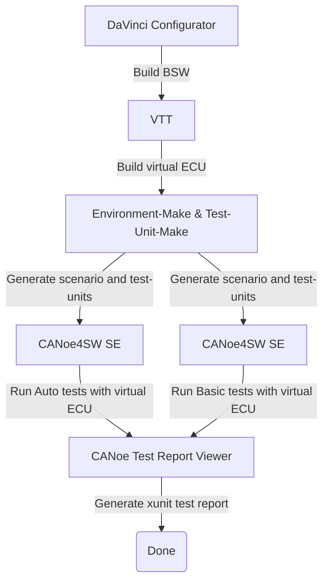

# CI-Demo Pipeline

Hello, and welcome to the CI-Demo-Repository.

## Table of Contents

- [CI-Demo Pipeline](#ci-demo-pipeline)
  - [Table of Contents](#table-of-contents)
  - [Introduction](#introduction)
  - [Dependencies](#dependencies)
  - [Repository Layout](#repository-layout)
  - [Pipeline Overview](#pipeline-overview)
  - [Trigger the pipeline](#trigger-the-pipeline)
  - [View the pipeline](#view-the-pipeline)
  - [Prepare the pipeline](#prepare-the-pipeline)
  - [Remarks](#remarks)

## Introduction

In an ever growing and more complex world, CI / CD solutions are key to develop and provide fast and reliable software solutions. By combining the work of the whole team in one repository and automatically test the changes, CI / CD provides fast testing and change feedback.
This repository should give you a peek into the capabilities of vector tools in a CI context. Starting with the changes of C-Code for an ECU, triggering the whole compilation and testing of the virtual ECU. Leading to test-reports, showing you if your changes broke some tests or functionality of your ECU.

In this demo repository, you can take action, by editing the C Files under [/ECU/Appl/](/ECU/Appl/) to trigger the attached CI pipeline and see the Vector Tools in action.
Afterwards you can observe the test-results and see, if your changes broke some tests.
## Dependencies

- internet connection

## Repository Layout

- [environment-make](/environment-make/) contains all files to run CANoe Make. Most importantly the `LightControl.venvironment.yaml` file, which describes the CANoe4SW SE setup.
- [doc](/doc/) contains documentation and additional infos.
- [ECU](/ECU/) contains the source code for the virtual ECU, which gets tested in this demo pipeline.
- [vTESTstudio](/vTESTstudio) contains the vTESTstudio project with the tests units.

## Pipeline Overview

<div class="table" align="center">



</div>

The pipeline file is located [here](/.github/workflows/main.yaml)

## Trigger the pipeline

There are two ways, on how to trigger the pipeline. The first and easy way, is to use the GitHub provided webeditor.
The second one is to use the git command-line tool. For this option, follow the instructions [here](/doc/trigger-with-git.md)

To trigger the pipeline, using the webeditor, do the following steps:

1. Go to the file you want to edit. For example /ECU/Appl/Source/LightCtrl.c

2. On the top right, there is a button called "Edit this file". Press it to be able to edit the file.

3. Do the changes and additions to the file you like.
    E.g.:
    Uncomment line 59 (“//rtb_LightIntensity_LightIntensi = 0;”) in the source code "/ECU/Appl/Simulink/LightCtrl_Model_autosar_rtw/LightCtrl_SWC.c" to cause test fails.  
    Info: Some tests will set the light intensity value and expect a changed head light result. Because the light intensity is now statically set to value zero, some tests will fail.

4. On the top right of the page, is an entry box, to commit the changes. It will prompt you to give a commit message. Write in text here as you like, and afterwards click the "Commit changes" button.

## View the pipeline

To see the pipeline working and the CANoe4SW_SE Test-Report:

```text
 Click "Actions" on the top. -> 
 Choose the most recent workflow run "passed" or "failed". ->
 Click on the last job "CANoe4SW_SE Tests" listed on the left side bar. ->
 View the test results.

```

For an image based guide, [click here](/doc/view-pipeline-and-tests.md)</br>
More details about the functionality of Vector Tools inside the pipeline can be viewed [here](/doc/pipeline.md).

## Prepare the pipeline

Due to the infrastructure's on-demand nature, it scales down to zero when not in use. To ensure the infrastructure is ready for immediate use, we recommend initiating the pipeline approximately 30 minutes prior to your actual need. This "warm-up" period allows the infrastructure to be fully operational and available the moment you require it.

## Remarks

- As you got through the files of the repo, you see that the Microsar-SIP part is missing. Due to licensing, this part has been moved to the runner for this demo.
If you use this pipeline on your own code and repo, you would commit it along the ECU source files.
