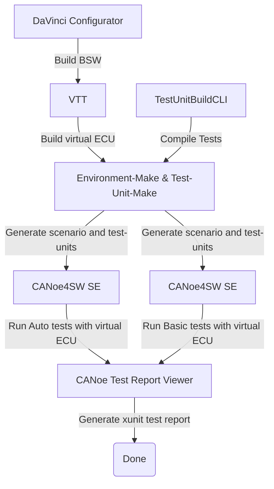

# Vector CANoe CLI Toolchain & Continuous Testing Sample

This project shows an example how to implement an automated Software-in-the-Loop test workflow (SIL-Test) for the development of an automotive ECU using the Vector toolchain, consisting of MICROSAR Classic, the DaVinci Toolchain, vVIRTUALtarget and CANoe4SW Server Edition (CANoe4SW SE).

The core part of the automated SIL-test approach is the use of text-based specification formats for simulation environments, allowing simulation environments to be constructed on a per-commit basis, thus supporting a branch/merge workflow with fast testing and change feedback of SIL-based system tests.
Furthermore, the on-demand construction of simulation setups also allows test execution to scale with the amount of available compute resources, rather than being limited by the availability of human operators for integrating new versions of the System-under-Test (SUT) into a simulation.

The intention of this repository is to serve as an example how such a system could be implemented as well as to be used as a starting point for implementing custom, project-specific test workflows.

## Table of Contents

- [Vector CANoe CLI Toolchain \& Continuous Testing Sample](#vector-canoe-cli-toolchain--continuous-testing-sample)
  - [Table of Contents](#table-of-contents)
  - [Introduction](#introduction)
  - [Overview](#overview)
  - [Implementation of the Example Scenario Using the Vector CLI Toolchain](#implementation-of-the-example-scenario-using-the-vector-cli-toolchain)
    - [Workflow Elements explained:](#workflow-elements-explained)
      - [Jobs and Steps:](#jobs-and-steps)
  - [Repository Layout](#repository-layout)
  - [Pipeline Overview](#pipeline-overview)
  - [Trigger the pipeline](#trigger-the-pipeline)
  - [View the pipeline](#view-the-pipeline)
  - [Prepare the pipeline](#prepare-the-pipeline)
  - [Remarks](#remarks)

## Introduction

In an ever growing and more complex world, CI / CD solutions are key to develop and provide fast and reliable software solutions. By combining the work of the whole team in one repository and automatically test the changes, CI / CD provides fast testing and change feedback.
This repository should give you a peek into the capabilities of vector tools in a CI context. Starting with the changes of C-Code for an ECU, triggering the whole compilation and testing of the virtual ECU. Leading to test-reports, showing you if your changes broke some tests or functionality of your ECU.

In this demo repository, you can take action, by editing the C Files under [/ECU/Appl/](/ECU/Appl/) to trigger the attached CI pipeline and see the Vector Tools in action.
Afterwards you can observe the test-results and see, if your changes broke some tests.

## Overview


The system developed in this example is the LightControl ECU.
The LightControl ECU implements an automatic control of the low beams of a car.
It is implemented as an AUTOSAR SWC running on top of Vector MICROSAR Classic.
You can find more details about the ECU in [SUT.md](SUT.md).

To facilitate the development of this ECU, the development organization performs large parts of their system testing as Software-in-the-Loop tests using a virtual ECU.
The virtual ECU is built using Vector vVIRTUALtarget.
The ECU is executed as part of a remaining bus simulation environment using Vector CANoe4SW SE.
In this simulation environment, the system test cases, that are authored in a YAML-based format and implemented using CAPL , can then be executed.
These test cases can be efficiently created and managed through our complimentary VSCode plugins.

For an ideal integration into the development workflow, the test workflow as depicted below is set up to run automatically whenever a pull request is opened on the repository.
Pull requests may contain changes to the ECU source code, the ECU BSW configuration, the test cases, and the simulation setup.
The test workflow consists of three stages: Rebuilding the SUT, simulation and test cases, running the simulations, and preparing the test results for display in the Web UI.
Rebuilding all parts of the simulation ensures that the test run considers exactly the changes provided in the given pull request, independent of any other changes that may be tested in parallel in concurrent pull requests.

TBD: see [here]() for an example pull request with an execution of the test workflow. -> TBD: Ensure that there is one!

We will explain the individual steps of the test workflow in more detail in subsequent sections.

<br clear="right">

## Implementation of the Example Scenario Using the Vector CLI Toolchain


To facilitate the aforementioned scenario, Vector provides its tools as a CLI toolchain version for automated operation, along with configuration formats following the everything-as-code philosophy.
In this section we will explain the steps involved in the test pipeline and how to use the Vector CLI toolchain in these steps.

If you are already familiar with the CLI toolchain and are just looking for sample configurations, see [CANoe simulation environment](environment-make/LightControl.venvironment.yaml), [VttMake configuration](ECU/LightControl.vttmake), [GitHub Action Workflow](.github/workflows/)

The overall test workflow consists of three stages:
* The Build stage, where the SUT, the simulation and the test units are rebuilt from source.
* The Simulate stage, where test units are executed in the simulated environment.
* The Display stage, where test results are converted for further processing, e.g., display in a Web UI dashboard.

The following image gives a detailed view of the steps on the test execution stages, the tools used in each stage as well as the input artifacts and output artifacts. The following subsections will provide more details on the implementation of each stage.


### Workflow Elements explained:
Here's the main elements of the following workflow [GitHub Action Workflow](.github/workflows/).

#### Jobs and Steps:

- **Build SUT**: Checks out the repository, utilizes caching to optimize the build process, and prepares the System Under Test (SUT) by rebuilding it from source.

- **Compile Simulation**: With the SUT prepared, the environment and tests are compiled. This job fetches the SUT and test case inputs that are needed for the compiler.

- **Run Simulation**: After having a compiled environment and test cases. This job will execute these testcases against the environment and provide a test result.

- **Display Test Report**: The final stage involves processing and displaying the test results. It fetches the results from the simulation, converts them into a format suitable for display, and then presents them on a Web UI dashboard. This allows for an easy review and analysis of the test outcomes.

- **Artifact Management**: Throughout the process, artifacts such as the compiled SUT, test cases, and test results are managed efficiently. They are used to pass outputs between jobs, ensuring that each step of the pipeline has access to the necessary inputs and outputs without redundant operations.

## Repository Layout

- [environment-make](/environment-make/) contains all files to run CANoe Make. Most importantly the `LightControl.venvironment.yaml` file, which describes the CANoe4SW SE setup.
- [doc](/doc/) contains documentation and additional infos.
- [ECU](/ECU/) contains the source code for the virtual ECU, which gets tested in this demo pipeline.
- [vTESTstudio](/vTESTstudio) contains the vTESTstudio project with the tests units.

## Pipeline Overview

<div class="table" align="center">



</div>

The pipeline file is located [here](/.github/workflows/main.yaml)

## Trigger the pipeline

There are two ways, on how to trigger the pipeline. The first and easy way, is to use the GitHub provided webeditor.
The second one is to use the git command-line tool. For this option, follow the instructions [here](/doc/trigger-with-git.md)

To trigger the pipeline, using the webeditor, do the following steps:

1. Go to the file you want to edit. For example /ECU/Appl/Source/LightCtrl.c

2. On the top right, there is a button called "Edit this file". Press it to be able to edit the file.

3. Do the changes and additions to the file you like.
    E.g.:
    Uncomment line 59 (“//rtb_LightIntensity_LightIntensi = 0;”) in the source code "/ECU/Appl/Simulink/LightCtrl_Model_autosar_rtw/LightCtrl_SWC.c" to cause test fails.  
    Info: Some tests will set the light intensity value and expect a changed head light result. Because the light intensity is now statically set to value zero, some tests will fail.

4. On the top right of the page, is an entry box, to commit the changes. It will prompt you to give a commit message. Write in text here as you like, and afterwards click the "Commit changes" button.

## View the pipeline

To see the pipeline working and the CANoe4SW_SE Test-Report:

```text
 Click "Actions" on the top. -> 
 Choose the most recent workflow run "passed" or "failed". ->
 Click on the last job "CANoe4SW_SE Tests" listed on the left side bar. ->
 View the test results.

```

For an image based guide, [click here](/doc/view-pipeline-and-tests.md)</br>
More details about the functionality of Vector Tools inside the pipeline can be viewed [here](/doc/pipeline.md).

## Prepare the pipeline

Due to the infrastructure's on-demand nature, it scales down to zero when not in use. To ensure the infrastructure is ready for immediate use, we recommend initiating the pipeline approximately 30 minutes prior to your actual need. This "warm-up" period allows the infrastructure to be fully operational and available the moment you require it.

After the completion of the last job in your pipeline, the infrastructure remains active for an additional 10 minutes before automatically scaling down to zero. If you require an extension of this active period, please reach out to an administrator.

## Remarks

- As you got through the files of the repo, you see that the Microsar-SIP part is missing. Due to licensing, this part has been moved to the runner for this demo.
If you use this pipeline on your own code and repo, you would commit it along the ECU source files.
