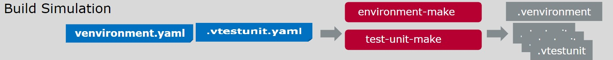

# Vector CANoe CLI Toolchain & Continuous Testing Sample

This project shows an example how to implement an automated Software-in-the-Loop test workflow (SIL-Test) for the development of an automotive ECU using the Vector toolchain, consisting of MICROSAR Classic, the DaVinci Toolchain, vVIRTUALtarget and CANoe4SW Server Edition (CANoe4SW SE).

The core part of the automated SIL-test approach is the use of text-based specification formats for simulation environments, allowing simulation environments to be constructed on a per-commit basis, thus supporting a branch/merge workflow with fast testing and change feedback of SIL-based system tests.
Furthermore, the on-demand construction of simulation setups also allows test execution to scale with the amount of available compute resources, rather than being limited by the availability of human operators for integrating new versions of the System-under-Test (SUT) into a simulation.

The intention of this repository is to serve as an example how such a system could be implemented as well as to be used as a starting point for implementing custom, project-specific test workflows.

## Table of Contents

- [Vector CANoe CLI Toolchain \& Continuous Testing Sample](#vector-canoe-cli-toolchain--continuous-testing-sample)
  - [Table of Contents](#table-of-contents)
  - [Introduction](#introduction)
  - [Overview](#overview)
  - [Repository Layout](#repository-layout)
  - [Implementation Example Using the Vector CLI Toolchain](#implementation-example-using-the-vector-cli-toolchain)
    - [Workflow Elements explained:](#workflow-elements-explained)
      - [Jobs and Steps:](#jobs-and-steps)
    - [Virutal ECU Generation](#virutal-ecu-generation)
    - [Simulation Enviromment \& Test Unit Compilation](#simulation-enviromment--test-unit-compilation)
    - [Run the Simulation \& Execute the Test Units](#run-the-simulation--execute-the-test-units)
    - [Test Result Visualization](#test-result-visualization)
  - [Deploying as a GitHub Action Pipeline](#deploying-as-a-github-action-pipeline)
    - [Vector Tools Execution in Containers](#vector-tools-execution-in-containers)
    - [Caching Implementation](#caching-implementation)
    - [Passing Artifacts](#passing-artifacts)
  - [Trigger the pipeline](#trigger-the-pipeline)
  - [View the pipeline](#view-the-pipeline)
  - [Prepare the pipeline](#prepare-the-pipeline)
  - [Remarks](#remarks)

## Introduction

In an ever growing and more complex world, CI / CD solutions are key to develop and provide fast and reliable software solutions. By combining the work of the whole team in one repository and automatically test the changes, CI / CD provides fast testing and change feedback.
This repository should give you a peek into the capabilities of Vector tools in a CI context. Starting with the changes of C-Code for an ECU, triggering the whole compilation and testing of the virtual ECU. Leading to test-reports, showing you if your changes broke some tests or functionality of your ECU.

In this demo repository, you can take action, by editing the C Files under [/ECU/Appl/](/ECU/Appl/) to trigger the attached CI pipeline and see the Vector Tools in action.
Afterwards you can observe the test-results and see, if your changes broke some tests.

## Overview


The system developed in this example is the LightControl ECU.
The LightControl ECU implements an automatic control of the low beams of a car.
It is implemented as an AUTOSAR SWC running on top of Vector MICROSAR Classic.
You can find more details about the ECU in [SUT.md](SUT.md).

To facilitate the development of this ECU, the development organization performs large parts of their system testing as Software-in-the-Loop tests using a virtual ECU.
The virtual ECU is built using Vector vVIRTUALtarget.
The ECU is executed as part of a remaining bus simulation environment using Vector CANoe4SW SE.
In this simulation environment the system test cases that are authored in a YAML-based format and implemented using CAPL can then be executed.
These test cases can be efficiently created and managed through our complimentary VSCode plugin, more info can be found [here](https://marketplace.visualstudio.com/items?itemName=VectorGroup.test-unit)

For an ideal integration into the development workflow, the test workflow as depicted below is set up to run automatically whenever a pull request is opened on the repository.
Pull requests may contain changes to the ECU source code, the ECU BSW configuration, the test cases, and the simulation setup.
The test workflow consists of three stages: Rebuilding the SUT, simulation and test cases, running the simulations, and preparing the test results for display in the Web UI.
Rebuilding all parts of the simulation ensures that the test run considers exactly the changes provided in the given pull request, independent of any other changes that may be tested in parallel in concurrent pull requests.

see below for an example pull request with an execution of the test workflow.


We will explain the individual steps of the test workflow in more detail in subsequent sections.

<br clear="right">


## Repository Layout

- [environment-make folder](/environment-make/) contains all files to run environment-make. Most importantly the `LightControl.venvironment.yaml` file, which describes the CANoe4SW SE setup.
- [doc folder](/doc/) contains documentation and additional infos.
- [ECU folder](/ECU/) contains the source code for the virtual ECU, which gets tested in this demo pipeline.
- [test folder](/test) contains the Capl Test cases along with their yaml format test that defines them


The pipeline file is located [here](/.github/workflows/main.yaml)

## Implementation Example Using the Vector CLI Toolchain

Vector offers its suite of tools in a CLI toolchain format for streamlined automated operations, along with configuration formats following the everything-as-code philosophy.
In this section we will explain the steps involved in the test pipeline and how to use the Vector CLI toolchain in these steps.

If you are already familiar with the CLI toolchain and are just looking for sample configurations, see [CANoe simulation environment](environment-make/venvironment.yaml), [VttMake configuration](ECU/LightControl.vttmake), [GitHub Action Workflow](.github/workflows/main.yaml)

The overall test workflow consists of three stages:
* The Build stage, where the SUT, the simulation and the test units are rebuilt from source.
* The Simulate stage, where test units are executed in the simulated environment.
* The Display stage, where test results are converted for further processing, e.g., display in a Web UI dashboard.

The following image gives a detailed view of the steps on the test execution stages, the tools used in each stage as well as the input artifacts and output artifacts. The following subsections will provide more details on the implementation of each stage.


### Workflow Elements explained:
Here's the main elements of the following workflow [GitHub Action Workflow](.github/workflows/).

#### Jobs and Steps:

- **Build SUT**: Checks out the repository, utilizes caching to optimize the build process, and prepares the System Under Test (SUT) by rebuilding it from source.

- **Compile Simulation**: With the SUT prepared, the environment and tests are compiled. This job fetches the SUT and test case inputs that are needed for the compiler.

- **Run Simulation**: After having a compiled environment and test cases. This job will execute these testcases against the environment and provide a test result.

- **Display Test Report**: The final stage involves processing and displaying the test results. It fetches the results from the simulation, converts them into a format suitable for display, and then presents them on a Web UI dashboard. This allows for an easy review and analysis of the test outcomes.

- **Artifact Management**: Throughout the process, artifacts such as the compiled SUT, test cases, and test results are managed efficiently. They are used to pass outputs between jobs, ensuring that each step of the pipeline has access to the necessary inputs and outputs without redundant operations.

### Virutal ECU Generation




The first step in the test workflow is to build the ECU SWC source code and ECU BSW/RTE configuration into a virutal ECU.
This is done using the `VttMake.exe` CLI executable of Vector vVIRTUALtarget.
`VttMake.exe` takes as input an XML file [`LightControl.vttmake`](ECU/LightControl.vttmake).
While being an XML file, the syntax of the `.vttmake` file format is designed to be so simple that it can be edited with any text editor.
The `.vttmake` file tells vVIRTUALtarget where to find the ECU project with the BSW configuration (Line 5) and points to the SWC implementation files (Lines 12-24).
Furthermore, it tells vVIRTUALtarget which compiler is used for building the ECU, so that the glue code between the BSW and the simulation tool and the build configuration can be generated accordingly.
`VttMake.exe` can also launch the DaVinci Configurator to generate the BSW configuation and RTE configuration into source code as well as call the configured compiler to compile the Virtual ECU as a shared library.

You can find all input artifacts for this job in the [`ECU` folder](ECU/).
The most notable output artifacts are the `ECU.dll`, the DLL containing the executable code for the virtual ECU, along with several files containing metadata for the DLL, all of which will be loaded into the CANoe simulation later on.

### Simulation Enviromment & Test Unit Compilation


The ECU configuration assumes a certain operation environment.
In the example, the LightControl ECU expects a connection to a CAN bus with other ECUs present to get sensor readings from and to send actuation commands to.
To provide this environment in the SIL Test, a CANoe remaining bus simulation is used that provides the needed CAN bus and that provides mocks of other ECUs the LightControl ECU needs to communicate with.

The simulation environment is defined in [`venvironment.yaml`](environment-make/venvironment.yaml).
This file defines the communication networks (Line 11), the communication description for these networks (Line 7) as well as all of the simulation participants.
Lines 27-35 load in the virtual ECU created previously, whereas Lines 17 onwards and Lines 37 and onwards define two mocked ECUs.
The mocked ECUs are implemented using CAPL.
Their implementation is also [available in this repository](environment-make/CAPL/).

The simulation definition in `venvironment.yaml` is designed to be written by hand using any YAML-capable editor.
It is then read by the `environment-make` tool.
`environment-make` gathers all input artifacts parts of the simulation (network databases, CAPL code, virtual ECUs) and compiles them into a simulation environment, suitable for execution by CANoe4SW SE.

Static input artifacts to creating the simulation environment are stored in [`environment-make`](/environment-make/).
The only input artifact that is not static is the virtual ECU.
It is collected from the [Virtual ECU Generation](#virutal-ecu-generation) step using the artifact handling capabilities of GitHub.
The output artifact of this step is the simulation environment folder `environment-make/lightcontrol_scenario.vscenario/Default.venvironment`.

Next, the tests for execution in CANoe4SW SE are implemented as test units in VSCode using Vector provided pluggins, they can be defined in yaml format, for [example](test/auto/auto.vtestunit.yaml)
Once the tests are prepared, the compilation of the test is done by running the `test-unit-make` tool, providing it with the location of the simulation environment as well as the location of the `.vtestunit.yaml` files created previously.
`test-unit-make` does not have a control file, it takes all of its configuration as command line parameters.

The output artifacts of the compiled tests are generated as `.vtestunit` files and they are located in the environment folder as well `environment-make`, each test unit will have its own folder in this directory.

### Run the Simulation & Execute the Test Units


Once all parts of the simulation and the test units are prepared, CANoe4SW SE is run to execute the simulation.
CANoe4SW SE simply reads the simulation environment and the test cases to execute in that environment from the command line.
When CANoe4SW SE is started, the simulation is started automatically.
CANoe4SW SE also automatically starts executing all test units that were given on the command line.
When test execution has finished, the simulation is stopped.
A brief information on the test results is given as part of the command line output.
The exit code of the CANoe4SW SE executable also indicates a test success or test failure.
For more detailed information, a standard `.vtestreport` file is produced for every test unit that was executed.
The `.vtestreport` can be stored as a build artifact for later review.

Note that not all test units for a given simulation environment have to be given to CANoe4SW SE at once.
Test units can be split across multiple parallel CANoe4SW SE executions, allowing for parallel execution on multiple runner instances of an automated test system.
This project makes use of the feature of Matrix Jobs to spawn independent simulation runs for every single test unit, thus parallelizing test execution, so long as there are sufficient compute resources available.

Input artifacts to this step are the `Default.venvironment` folder as well as the respective test units folder.
The output artifact is one `.vtestreport` file per test unit provided to CANoe4SW SE.
Each `.vtestreport` file is named after the corresponding test unit.

### Test Result Visualization


The output of CANoe4SW SE can be used to give an overall idea of test success/test failure of the provided state of the repository.
However, in many cases it is necessary to have more in-depth information on which test cases passed or failed, e.g. to compute statistics on test success or to identify tests that are currently accepted to fail and should thus not impact the test verdict.

To this end, Vector TestReportViewer provides the `ReportViewerCLI` which can be used to export each `.vtestreport` to XUnit files that can be conmsumed by other tools.
As part of this sample, the XUnit result is displayed in the Web UI.

The input artifacts to this step are the `.vtestreport` files produced by the CANoe4SW SE simulation runs.
The output artifacts are `_xunit.xml` files.

Note that `.vtestreport` files can be processed independently of one another.
Thus, this step can also be parallelized if the need arises.

## Deploying as a GitHub Action Pipeline

### Vector Tools Execution in Containers

- **Containerized Execution**: Vector tools run within Docker containers, ensuring consistent, isolated environments for each test run, facilitating replicable tests and simulations.
- **Dockerfiles Location**: Required Dockerfiles for setting up these containers are located under a default installation path, like `C:\Users\Public\Documents\Vector\CANoe4SW Server Edition\17 (x64)\Samples\`. These files configure the necessary environments for Vector tools.

### Caching Implementation

- **Efficiency Through Caching**: The workflow utilizes caching for the SUT and BSW components, enhancing efficiency by reducing build times and conserving resources.
- **Caching Strategy**: Utilizes GitHub Actions' `cache@v4` action to cache specific directories, with cache keys based on file hashes to detect changes and ensure that only modified components are rebuilt.

### Passing Artifacts

- **Artifact Sharing Between Jobs**: Compiled components, such as the SUT and simulation environments, are efficiently passed between jobs using GitHub Actions' artifact management features.
- **Artifact Retention**: Artifacts are set with retention policies (e.g., 7 days) to be available as needed without consuming unnecessary storage.

## Trigger the pipeline

There are two ways, on how to trigger the pipeline. The first and easy way, is to use the GitHub provided webeditor.
The second one is to use the git command-line tool. For this option, follow the instructions [here](/doc/trigger-with-git.md)

To trigger the pipeline, using the webeditor, do the following steps:

1. Go to the file you want to edit. For example /ECU/Appl/Source/LightCtrl.c

2. On the top right, there is a button called "Edit this file". Press it to be able to edit the file.

3. Do the changes and additions to the file you like.
    E.g.:
    Uncomment line 59 (“//rtb_LightIntensity_LightIntensi = 0;”) in the source code "/ECU/Appl/Simulink/LightCtrl_Model_autosar_rtw/LightCtrl_SWC.c" to cause test fails.  
    Info: Some tests will set the light intensity value and expect a changed head light result. Because the light intensity is now statically set to value zero, some tests will fail.

4. On the top right of the page, is an entry box, to commit the changes. It will prompt you to give a commit message. Write in text here as you like, and afterwards click the "Commit changes" button.

## View the pipeline

To see the pipeline working and the CANoe4SW_SE Test-Report:

```text
 Click "Actions" on the top. -> 
 Choose the most recent workflow run "passed" or "failed". ->
 Click on the last job "CANoe4SW_SE Tests" listed on the left side bar. ->
 View the test results.

```

For an image based guide, [click here](/doc/view-pipeline-and-tests.md)</br>
More details about the functionality of Vector Tools inside the pipeline can be viewed [here](/doc/pipeline.md).

## Prepare the pipeline

Due to the infrastructure's on-demand nature, it scales down to zero when not in use. To ensure the infrastructure is ready for immediate use, we recommend initiating the pipeline approximately 30 minutes prior to your actual need. This "warm-up" period allows the infrastructure to be fully operational and available the moment you require it.

After the completion of the last job in your pipeline, the infrastructure remains active for an additional 10 minutes before automatically scaling down to zero. If you require an extension of this active period, please reach out to an administrator.

## Remarks

- As you got through the files of the repo, you see that the Microsar-SIP part is missing. Due to licensing, this part has been moved to the runner for this demo.
If you use this pipeline on your own code and repo, you would commit it along the ECU source files.
