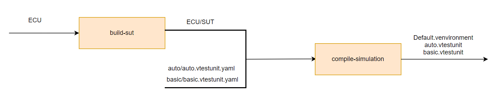
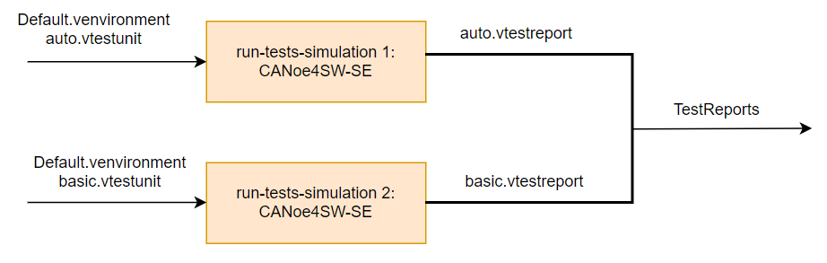
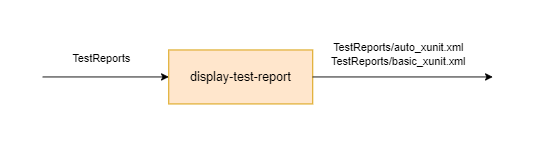

# CI Pipeline
This document is an overview of the pipeline's main functionality.

## Pipeline Stages
The pipeline is split into 3 stages: Build, test and convert. The Build stage is responsible for generating BSW (basic software) and building SUT (System Under Test). The Test stage runs the simulation and passes the result to the Convert stage. The last stage converts the test reports into JUunit format to be displayed in GitHub Actions' UI.  
Each of these stages are further split into Jobs.

### Build Stage
This stage consists of 3 jobs: `build-sut` and `build-simulation`. The results of this stage are the SUT and compiled environment ready for simulation.
- build-sut: **DaVinci Configurator** is used to build Basic Software. The Microsar-SIP for this demo is embedded into the GitHub runner. Then, **VTT** is used to build SUT using Visual Studio Build Tools
- build-simulation: In this job, **environment-make** is used to create an environment for a SUT from the `venvironment.yaml` and builds all required binary artifacts for the environment. Then **test-unit-make** is used to compile test units given in the yaml format as inputs. Test units can then be executed via the command line tool canoe4sw-se.  

The approach of using a `venvironment.yaml` file instead of `.rtcfg` files simplifies separation of test units which in turn enables further parallelization. Using the environment approach, it is possible to created multiple environments and compile test units in parallel.

Below is an illustration of the build stage jobs flow

### Test Stage
The test stage consists of 1 job: `run-tests-simulation`. The results of this stage are test reports that show the verdict of tests execution. However, this job spawns 2 jobs in runtime to run tests in parallel.
- run-tests-simulation: The **canoe4sw-se** CLI tool is used to execute all tests in the simulation environment. Since CANoe4SW-SE supports parallel execution, the two test units are executed simultaneously in parallel.

Below is an illustration of the test stage jobs flow

### Convert Stage
The final stage of the pipeline. It consists of 1 job: `display-test-report`. The results of this stage are JUnit formatted test reports that can be displayed in GitHub Actions' UI.
- display-test-report: The test reports format is transformed to XML using **ReportViewerCli**. Then using the cscript.exe tool, the XML reports are further modified to the JUnit format.

Below is an illustration of the test stage jobs flow

