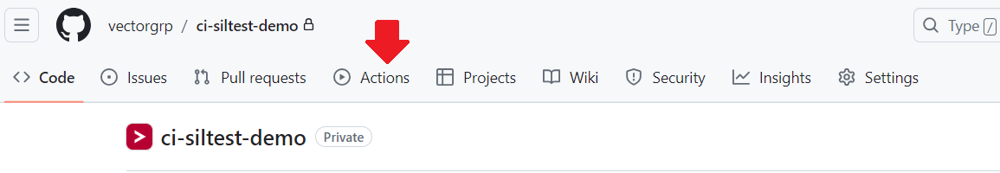
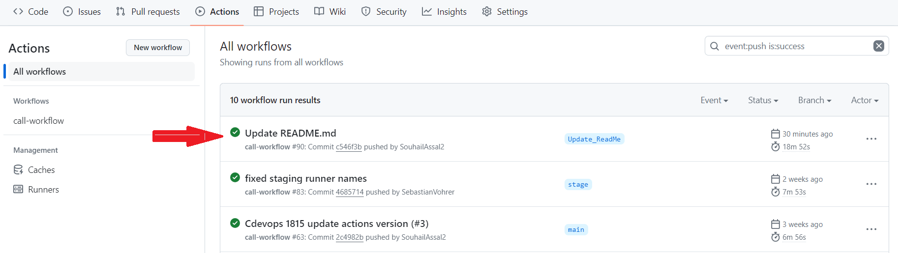
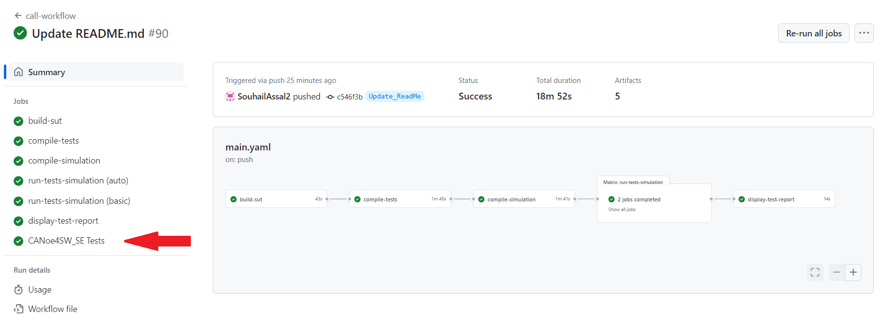
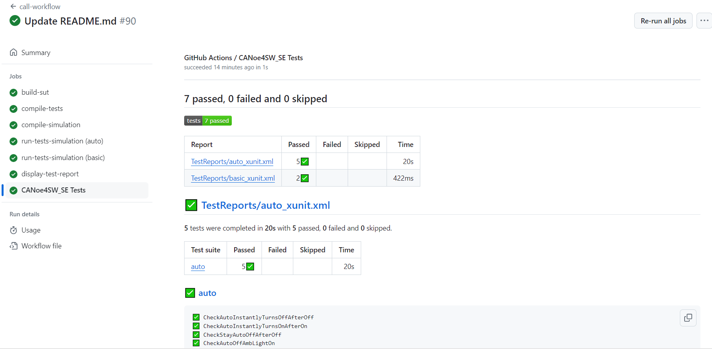

# Image based guide to view pipeline

## Click "Actions" on the top

## Choose the most recent workflow run "passed" or "failed"

## Click on the last job "CANoe4SW_SE Tests" listed on the left side bar.

## View the test results

