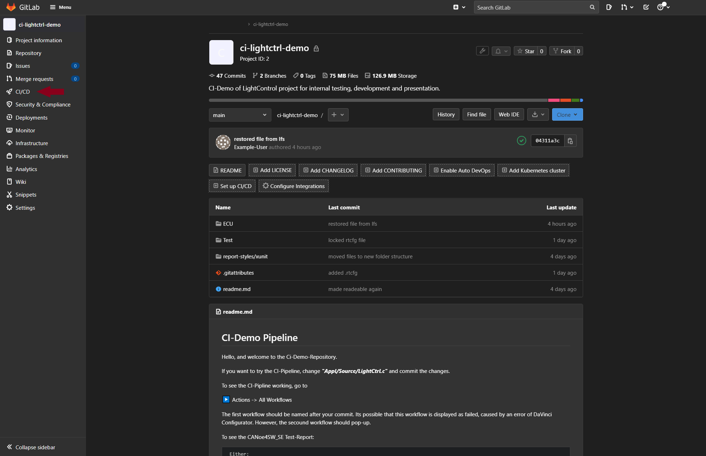
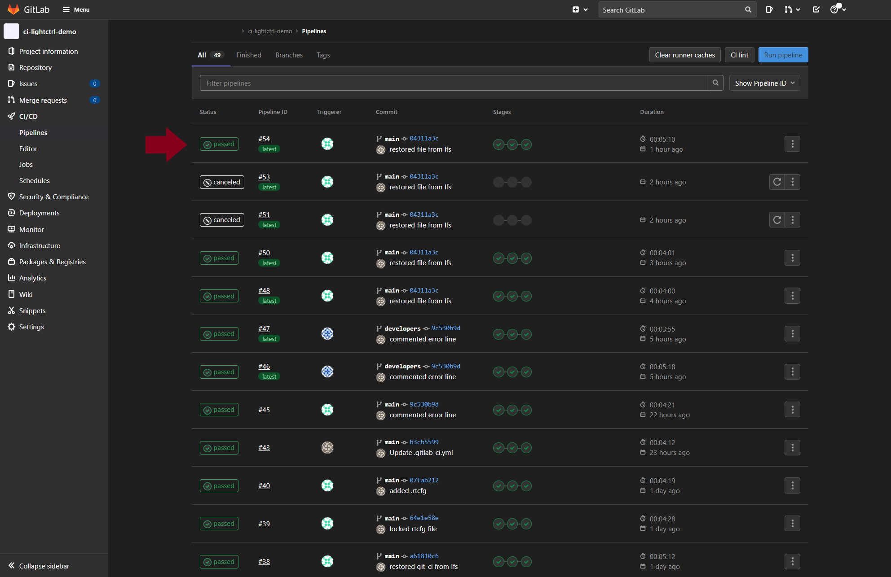
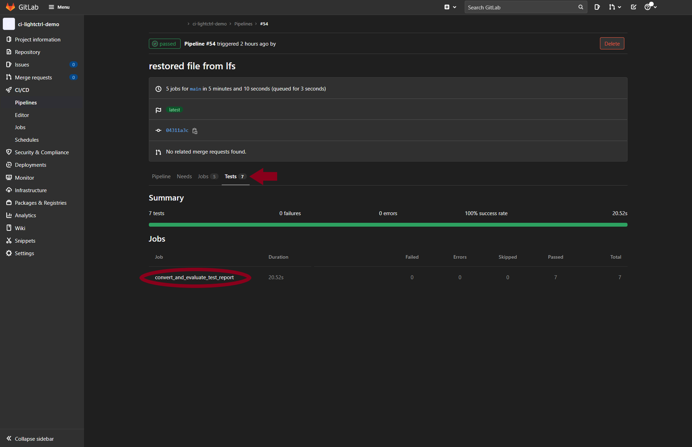
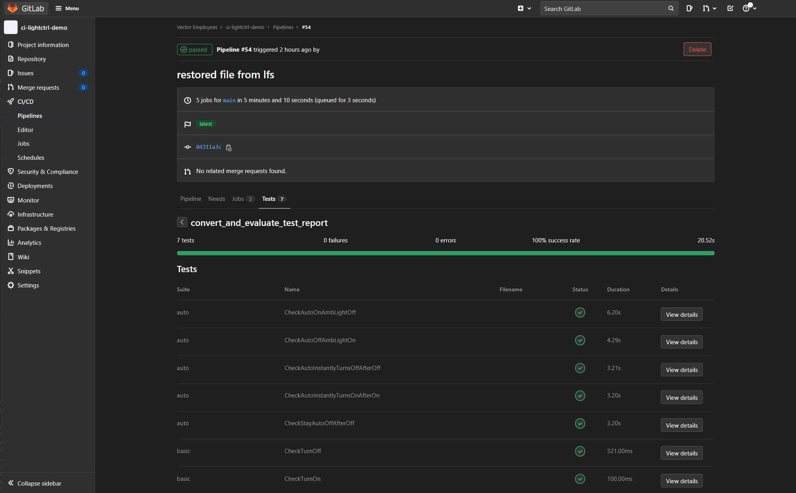

# Image based guide to view pipeline

## Click "CI/CD" on the left side

## Choose the most recent run by clicking in the status icon "passed" or "failed"

## Click on "Tests" on center of the screen

## Click on the listed job and view the test results

